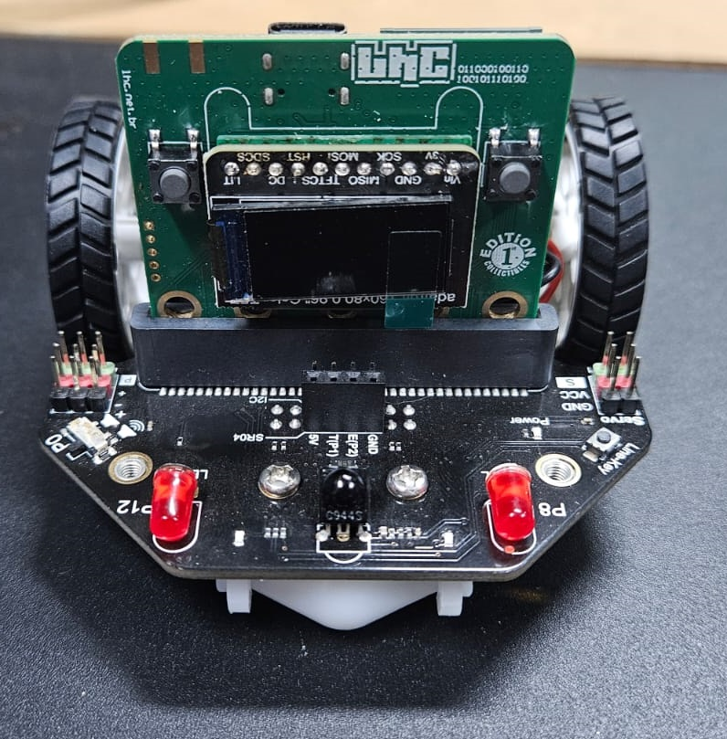
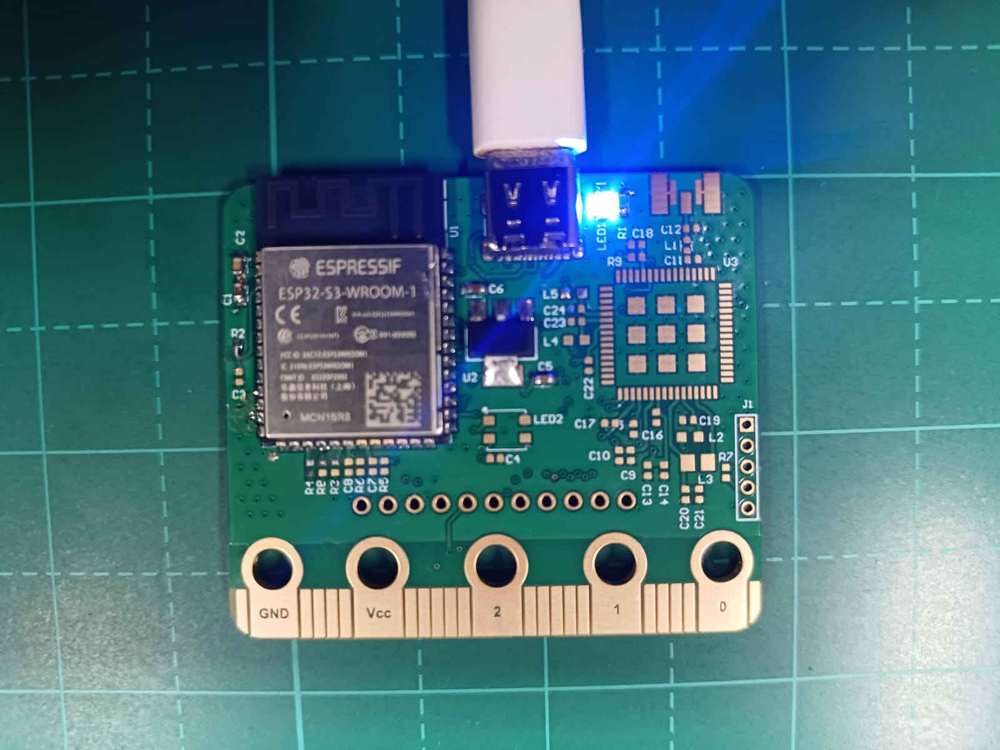
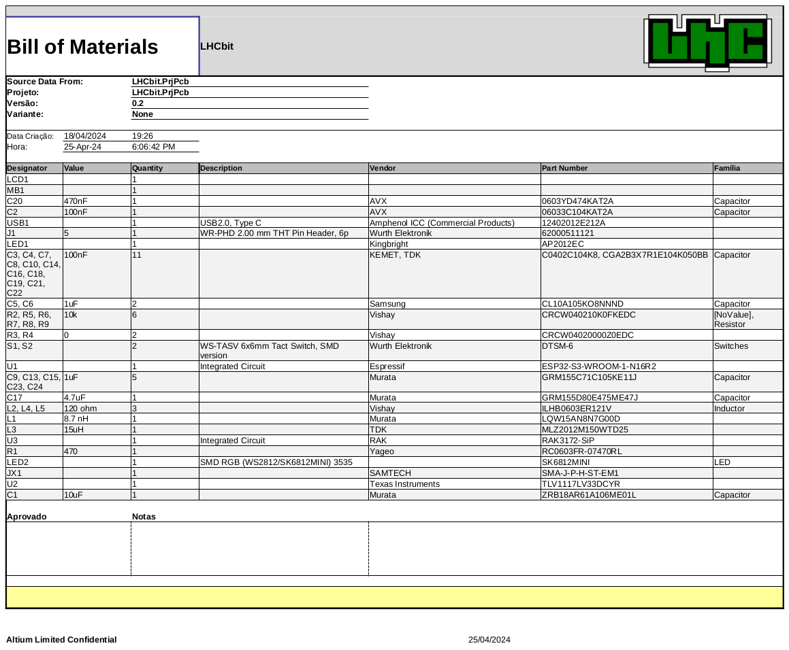

# LHCBbit

# O que é esse repositório ou projeto?
LHCbit  é uma placa de desenvolvimento para a comunidade, uma ferramenta de aprendizado open-source, composta por:
- ESP32-S3 - Microcontrolador com wifi e bluetooth
- STM32WLE5 - Microcontrolador ARM cortex M4 com LoRa
- Display LCD color 0.96
- LED RGB
- 2 botões
- Conector USB type C
- Padrão Microbit, sendo possível usar todos os projetos open source voltadas para a microbit.

- 

Esse repositório fica com os principais arquivos do hardware LHCbit, lista BOM (bill of material)  e logs da evolução do projeto como texto sobre via readme.md, com chamadas, links, pré-vendas e atualização das etapas da execução do projeto aberto.

Como todo repositório de projeto é algo vivo e com constantes atualizações e melhorias no projeto, então fique convidado a colaborar.

# Como funciona?
É um projeto aberto e colaborativo, funciona de forma bem simples, basta entrar em contato com os participantes e comparecer nas atividades anunciadas pelo Laboratório Hacker de Campinas, esse projeto envolve pessoas que realizaram o desenvolvimento em seu tempo livre e conforme sua disponibilidade. Para mais detalhes procurar as pessoas envolvidas que um projeto inclusive e estão disponíveis para explicar e coletar feedback.

O Projeto tem sua licença descrita, basta contribuir, replicar, comentar, é interessante notificar e passar feedback do que foi feito ou melhorias para o projeto manter sua evolução de aprimoramento, também citar e manter a licença que foi dada ao projeto.

# Quem usará esse repositório ou projeto?
Hackers, desenvolvedores de hardware, professores com interesse em construções de placas PCB, Pesquisadores universitários e técnicos e entusiastas que usarão esse repositório, não temos muitas restrições. Podendo utilizar esse projeto e algumas referências de projetos anteriores para aprender, replicar, desenvolver em cima evoluindo a ideia e projeto, citar em projeto ou usar aprendizagem envolvida para construções de novos projetos. Basta manter a ética e respeitar as licenças de projetos abertos.

# Qual o objetivo deste projeto?
O objetivo deste projeto é a construção de um hardware aberto e colaborativo para que pessoas consigam desenvolver seus projetos pessoais, ou conjuntos de pessoas passe pelas etapas de desenvolvimento de hardware até uma implementação de aplicação com o hardware desenvolvido. Ganhando experiência no que tem de tecnologia disponível para hardware e suas aplicações.

Teremos novas etapas desse projeto que é execuções de atividades e projetos com esse hardware. Para isso acompanhe a nossa lista de discussão sobre:

# Como faço para que esse projeto funcione na minha máquina?
Para que você consiga ter uma boa experiência em baixar os arquivos na sua máquina, conseguindo replicar, modificar ou desenvolver. Basta baixar os arquivos em seu equipamento local, utilizar as ferramentas adequadas para edição e construções do projeto.

Os esquemáticos foram escritos com a ferramenta [Altium](https://www.altium.com/), mas contribuições para portar para outras ferramentas serão bem vindas.
A princípio pode ser utilizado [essa ferramenta web](https://www.altium.com/viewer/) para visualizar os esquemáticos.

As evoluções do firmware (getting started) poderão ser acompanhadas [nesse projeto](https://github.com/lhc/LHCbit/tree/main)

# Como posso ajudar neste projeto?
Você também pode contribuir de diversas formas, seja revisando a documentação, arquivos CAD do hardware.
Gerando um PR Pull Request de melhorias conforme suas experiências e testes sobre hardware.
Divulgar e marcar o projeto nas redes sociais ou citar os nossos links como referência, ou até mesmo escrevendo e participando dos nossos encontros.

# Qual a licença para este projeto ?
Esse projeto está sobre a licença:
[Revisando arquivo de licença]

# Fotos do projeto

# Checklist Review 0.1
- O VCC e GND estava em curto, revisado por Leandro Pereira

# Checklist Review 0.2

| Itens           | Check | Double Check  |
|---------------------|----------|----------|
| Alimentação 3V3| OK |  |
| LoRa RAK3172-SiP|  |  |
| Reset e Boot| OK |  |
| USB Type C | OK |  |
| OLED|  |  |
| ESP32-S3-16R8 pinout| OK |  |

- [x] [Bill of Materials BOM](Templates/BOM%20Default%20Template.xlsx)

Oficina de apresentação do projeto
[definindo] eventos.lhc.net.br

# Equipe
 - Leandro Pereira
 - Douglas Esteves
 - Manasses
 - Matheus Brito
 - Marcelo Junqueira
 - Estevan

# Agradecimentos especial aos apoiadores do Projeto
- Daniel Barbosa
- L.
- Juliana Karoline
- Fabio Barros
- Luciano Ramalho
- Jomar Silva
- Estevan Castilho

# LOG
- 24/07/2024 Status do projeto (e-mail aos apoiadores)
- 18/07/2024 Reunião interna para apresentar LHCbit aos associados e definiação da fabricação da pcb para o display
- 12/07/2024 Update e consulta aos apoiadores do projeto (e-maisl aos apoiadores)
- 20/06/2024 Reunião interna para comunicar apoiadores e documentar projeto
- 13/06/2024 Status do projeto (e-mail aos apoiadores)
- 25/04/2024 update README
- 15/08/2024 Montagem final da LHCbit edition collectibles
- 05/09/2024 Apresentação sobre o projeto no LHC e remoto
- 12/09/2024 [Porte da LHCbit para NuttX](https://github.com/apache/nuttx/blob/master/Documentation/platforms/xtensa/esp32s3/boards/esp32s3-lhcbit/index.rst)
- 26/09/2024 Reunião e avaliação do github
- 03/10/2024 Reunião e revisão de hardware e github

# Contatos:
 - [Discourse](https://discourse.lhc.net.br/c/hardware/21)

# Contribuidores

<table>
<tr>
    <td align="center" style="word-wrap: break-word; width: 127.5; height: 127.5">
        <a href=https://github.com/EstevesDouglas>
            
             
            <b>Douglas Esteves</b>
        </a>
    </td>
    <td align="center" style="word-wrap: break-word; width: 127.5; height: 127.5">
        <a href=https://github.com/LeandroTE>
            
             
            <b>Leandro Pereira</b>
        </a>
    </td>
    <td align="center" style="word-wrap: break-word; width: 127.5; height: 127.5">
        <a href=https://github.com/manasouza>
            
             
            <b>Manassés Loiola de Souza</b>
        </a>
    </td>
