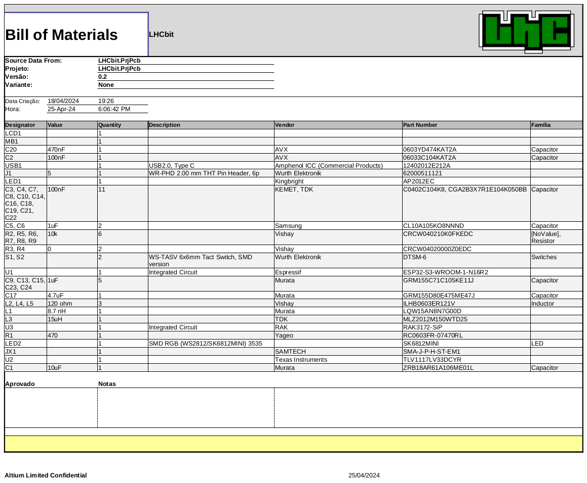

# LHCbit
Placa de desenvolvimento para software embarcado baseado no formato da microbit

- [x] [BOM]([https://discourse.lhc.net.br/t/parte-05-finalizando-o-nodelhc-esp32-com-kicad/244](https://github.com/lhc/LHCbit/blob/main/Templates/BOM%20Default%20Template.xlsx))

# LOG
- 25/04/2024 update README
