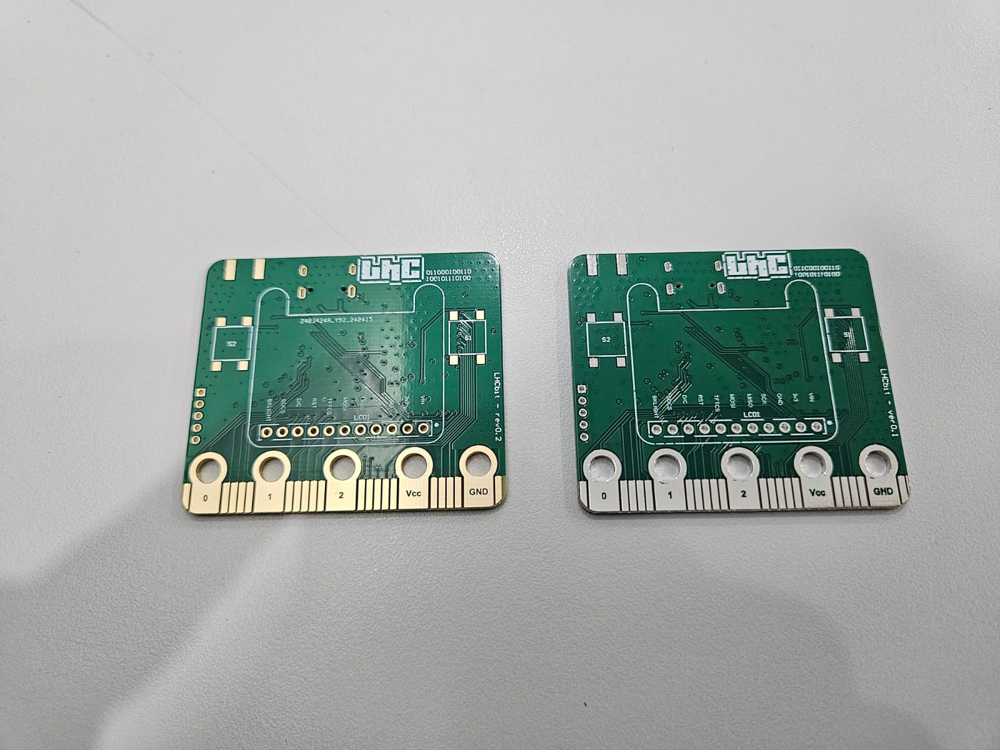
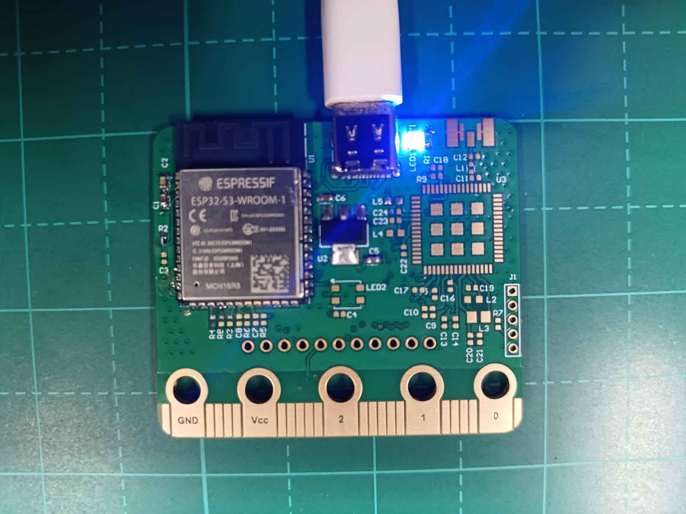

# LHCbit

Placa de desenvolvimento para software embarcado baseado no formato da microbit

# Checklist Review 0.1
- O VCC e GND estava em curto, revisado por Leandro Pereira

# Checklist Review 0.2

| Itens           | Check | Double Check  |
|---------------------|----------|----------|
| Alimentação 3V3|  |  |
| LoRa RAK3172-SiP|  |  |
| Reset e Boot|  |  |
| USB Type C |  |  |
| OLED|  |  |
| ESP32-S3-16R8 pinout|  |  |

- [x] [BOM](Templates/BOM%20Default%20Template.xlsx)

# Oficina de apresentação do projeto
- [definindo] eventos.lhc.net.br

  
# LOG
- 25/04/2024 update README
