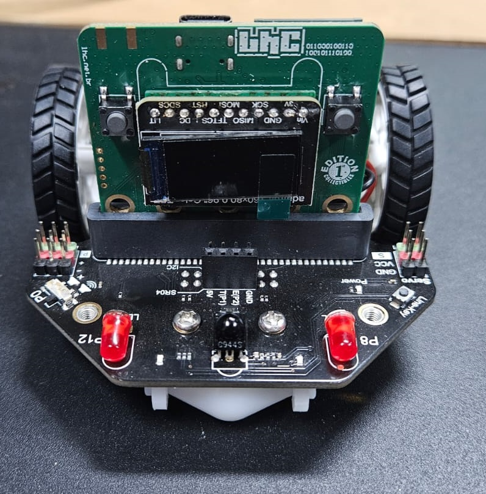

# Desenvolvimento de HW LHC

Desde a sua fundação vários projetos de HW abertos foram desenvolvidos no LHC, usando diferentes processadores e ferramentas.
Este repositório contém todos os projetos já desenvolvidos no LHC.

# Projetos

- nodeLHC
- nodeLHC-ESP32
- LHCbit

# Oficinas

Página do Evento: https://eventos.lhc.net.br/event/live-construindo-sua-placa-em-kicad

# Bibliotecas

- Biblioteca desenvolvida durante oficina Construindo sua placa em Kicad

# Checklist Review 0.1
- O VCC e GND estava em curto, revisado por Leandro Pereira

# Checklist Review 0.2

| Itens           | Check | Double Check  |
|---------------------|----------|----------|
| Alimentação 3V3|  |  |
| LoRa RAK3172-SiP|  |  |
| Reset e Boot|  |  |
| USB Type C |  |  |
| OLED|  |  |
| ESP32-S3-16R8 pinout|  |  |

- [x] [BOM](LHCbit/Templates/BOM%20Default%20Template.xlsx)

# Oficina de apresentação do projeto
- [definindo] eventos.lhc.net.br

  
# LOG
- 25/04/2024 update README
