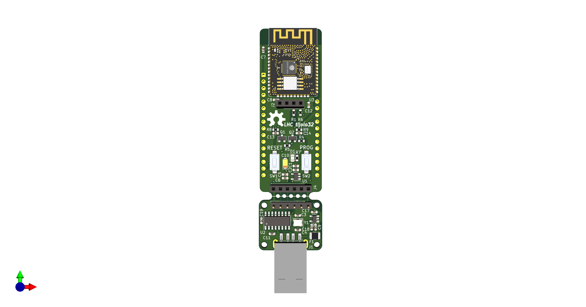

## nodeLHC

# nodeLHC-ESP32

LIVE em formato Hands On Construindo o nova versão da placa de desenvolvimento nodeLHC ESP32, com o Pedro Minatel, utilizando a ferramenta Kicad, o módulo escolhido foi o ESP32 um microcontrolador de baixo custo da Espressif.

Em 2015 durante as oficinas de IoT no Hackerspace, criamos uma primeira versão do nodeLHC com o módulo ESP8266. Assim as pessoas aprenderam as diferentes etapas para construção de placa de circuitos impressos, também soldagem dos componentes da placa de desenvolvimento e programação para o módulo.

Descrições e detalhes:
Essa é uma primeira atividade que ao decorrer iremos construir novos projetos no formato aberto e colaborativo aproveitando a placa de desenvolvimento nodeLHC ESP32

- [KiCad](https://kicad.org/)
- [LHC KiCad Library](https://github.com/lhc/lhc_kicad_library)
- [Minatel KiCad Library](https://github.com/pedrominatel/minatel-kicad-libraries)
- [SparkFun KiCad Library](https://github.com/sparkfun/SparkFun-KiCad-Libraries)

# Checklist
- [x] LIVE 1 - Explicação geral e desenho
- [x] LIVE 2 - Revisão esquemático e desenho da PCB parcial
- [x] Lista de pessoas interessadas nos módulos
- [x] [20/11 às 20 horas : Feedback comunidade](https://discourse.lhc.net.br/t/parte-03-20-11-2020-coleta-de-feedback-do-nodelhc-esp32/225)
- [x] [LIVE 3 no dia 22 de janeiro de 2021 - Finalizar placa com KiCad](https://discourse.lhc.net.br/t/parte-05-finalizando-o-nodelhc-esp32-com-kicad/244)
- [x] Enviado o e-mail de confirmação aos interessados ao módulos ESP32
- [x] [Lista de interessados na compra coletiva](https://docs.google.com/forms/d/11yyAbOFoUoV5jsIAHc90laWFHk0OwfYHXRMlwPwyAws/edit)
- [x] Reunião online para novos revisores.
- [x] Validar artes na PCB (LHC/ Open Hardware)
- [x] [Videoconferência Revisão do nodeLHC: 25 Maio 2021 às 20 horas](meet.google.com/ngs-ypnc-mkd)

# Próximos passos
- [x] Convite Latinoware 2021
- [ ] Listar BOM / Orçamentos
- [ ] Produção da PCB
- [ ] LIVE de soldando o nodeLHC
- [ ] Distribuição para os participantes

# Checklist Review 01 nodeLHC

| Itens           | Check | Double Check  |
|---------------------|----------|----------|
| Alimentação 3V3| [Fechado](https://github.com/lhc/nodeLHC-ESP32/issues/2) | [Fechado](https://github.com/lhc/nodeLHC-ESP32/issues/9) |
| RX/TX| [Fechado](https://github.com/lhc/nodeLHC-ESP32/issues/3) | [Fechado](https://github.com/lhc/nodeLHC-ESP32/issues/10) |
| Reset e Boot| [Fechado](https://github.com/lhc/nodeLHC-ESP32/issues/4) | [Fechado](https://github.com/lhc/nodeLHC-ESP32/issues/11) |
| Conversor USB para UART| [Fechado](https://github.com/lhc/nodeLHC-ESP32/issues/5) | [Fechado](https://github.com/lhc/nodeLHC-ESP32/issues/12) |
| Conector Debug/JTAG| [Fechado](https://github.com/lhc/nodeLHC-ESP32/issues/6) | [Fechado](https://github.com/lhc/nodeLHC-ESP32/issues/13) |
| OLED| [Fechado](https://github.com/lhc/nodeLHC-ESP32/issues/7) | [Fechado](https://github.com/lhc/nodeLHC-ESP32/issues/14) |
| ESP32-WROMM pinout| [Fechado](https://github.com/lhc/nodeLHC-ESP32/issues/8) | [Fechado](https://github.com/lhc/nodeLHC-ESP32/issues/15) |

# Revisores
- Daniel
- Adrian
- Manassés
- Douglas

## Bill of Materials
| Component           | Quantity | Link                                             |
|---------------------|----------|--------------------------------------------------|
| ESP32-WROOM-   | 1        |                                                  |
|  |      |                                                  |

[Clique aqui](https://htmlpreview.github.io/?https://github.com/lhc/nodeLHC-ESP32/blob/master/projeto/bom/ibom.html) para ver a BOM interativa

Para gerar a BOM interativa, é necessário [instalar o plugin no KiCad](https://github.com/openscopeproject/InteractiveHtmlBom/wiki/Installation) e seguir as [orientações de uso](https://github.com/openscopeproject/InteractiveHtmlBom/wiki/Usage)

Para utilizar o plugin, no KiCad 6.x, após instalação concluída, utilize `PCB Editor > Tools > External Plugins > Generate Integractive HTML BOM`

# Vídeos gravados
- [Construindo o nodeLHC ESP32 com Kicad - Parte 01 #nodeLHC](https://youtu.be/l77AwA57H2A?t=1641)
- [Construindo o nodeLHC ESP32 com Kicad - Parte 02 #nodelhc](https://www.youtube.com/watch?v=WE6jsmoJX9M)
- [Construindo o nodeLHC ESP32 com Kicad - Parte 05](https://www.youtube.com/watch?v=1r1fcpELneA)

# Discourse
Dúvidas? sugestões publicar na issues ou direto no discourse do LHC
- [Parte 01 - 28/07/2020 LIVE - Hands On: Construindo o nodeLHC ESP32 com Kicad](https://discourse.lhc.net.br/t/28-07-2020-live-hands-on-construindo-o-nodelhc-esp32-com-kicad/148/2)
- [Parte 02 - Hands On: Construindo o nodeLHC ESP32 com Kicad](https://discourse.lhc.net.br/t/11-09-2020-live-hands-on-construindo-o-nodelhc-esp32-com-kicad-parte-02/160)
- [Parte 03 - Feedback comunidade](https://discourse.lhc.net.br/t/parte-03-20-11-2020-coleta-de-feedback-do-nodelhc-esp32/225)
- [Parte 04 - Melhorias para o nodeLHC ESP32](https://discourse.lhc.net.br/t/parte-04-melhorias-para-o-nodelhc-esp32/230/2)
- [Parte 05 - 22/01 às 20 horas: Hands On: Construindo o nodeLHC ESP32 com Kicad](https://discourse.lhc.net.br/t/parte-05-finalizando-o-nodelhc-esp32-com-kicad/244)

# Documentações em outras plataformas
- [Hackday.io](https://hackaday.io/project/177704-lhc-tijolo32-esp32-development-board)

# Log
- 19/08/2020 - Criado o evento, repositório, publicações nas redes sociais gerado link sobre a atividade.
- 02/09/2020 - Criado, divulgado o segundo evento, atualização de links no repositório.
- 06/10/2020 - Listagem das pessoas que responderam o discourse para receber o módulo ESP32
- 07/10/2020 - Chegaram os módulos.
- 17/11/2020 - Agendada conversa de feedback do projeto, divulgação da atividade.
- 16/01/2021 - Pedro fez update conforme o último encontro de feedback.
- 17/01/2021 - Atualizado no repositório, criado agenda de LIVE para o dia 22 de janeiro de 2021.
- 07/02/2021 - Enviado e-mail aos interessados aos módulos
             - Divulgação da compra coletiva de componentes para o nodeLHC
- 11/03/2021 - Atualização de revisão e update no projeto
- 16/03/2021 - Atualização de imagens e links de gravações
- 30/05/2021 - Feedback do Daniel registrado e atualização no README.md

### Referências
- [ESP32 Datasheet](https://www.espressif.com/sites/default/files/documentation/esp32_datasheet_en.pdf)
- [ESP32-WROOM Datasheet](https://www.espressif.com/sites/default/files/documentation/esp32-wroom-32d_esp32-wroom-32u_datasheet_en.pdf)
- [ESP32 Design Guidelines](https://www.espressif.com/sites/default/files/documentation/esp32_hardware_design_guidelines_en.pdf)
- [CH340G](https://cdn.sparkfun.com/datasheets/Dev/Arduino/Other/CH340DS1.PDF)
- [Open Source Hardware Association](https://www.oshwa.org/definition/)
